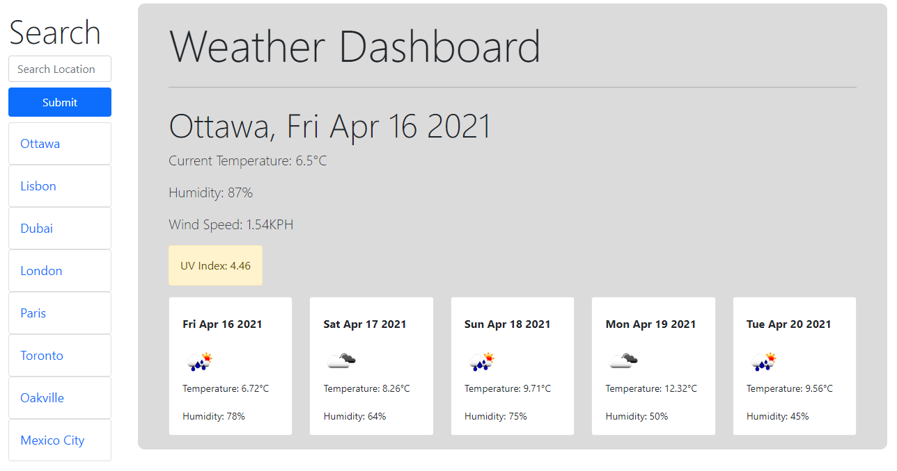

# weather_dashboard

This small application enables users to search for a city in the input field and recieve weather data for the city. This weather data includes the following information:

- Temperature
- Humidity
- Wind Speed
- UV Index
- 5 Day Forecast

Once a city is searched, the city is added to a card to the left hand side of the page. A user can then click on that card to revisit the weather information for that city. 

Here is a link to the deployed application: https://ayfor.github.io/weather_dashboard/

